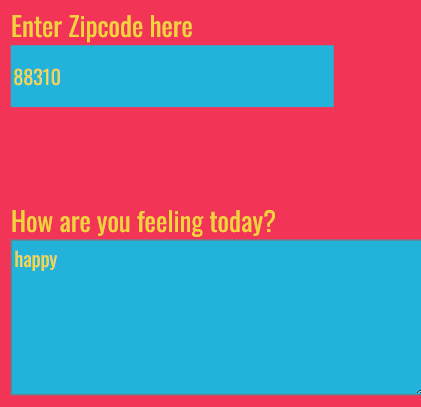

# Project Title
Weather-Journal App Project

This project is a part of [Udacity](https://www.udacity.com/course/front-end-web-developer-nanodegree--nd0011) Front End Developer Nanodegree program.

## Table of Contents
- [Project Title](#project-title)
- [Table of contents](#table-of-contents)
- [Languages Used](#languages-used)
- [Description](#description)
- [Motivation](#motivation)
- [Installation](#installation)
- [Contribute](#contribute)
- [ScreenShots](#screenshots)
- [License & Copyright](#license--copyright)

## Languages used
1. HTML
2. CSS
3. JAVASCRIPT
4. Node 
5. Express  

[(Back to top)](#table-of-contents)

## Description
Apply your new skills to combine data from the OpenWeatherMap API and client side (browser) HTML forms to create a web app that records a weather journal for users. This project requires you to create an asynchronous web app that uses Web API and user data to dynamically update the UI for a Weather Journal App.

[(Back to top)](#table-of-contents)

## Motivation
This project is made to show how can you contact api and get data from it.

[(Back to top)](#table-of-contents)

## Installation
- You can Install this project to your PC using clone the repo to your github account then Download It as a ZIP File to your PC.
- Install express, cors, body-parser (npm install express ...)
- In the terminal or cmd write node server.js to run local server
- go to website and wirte http://localhost:3300/ 

[(Back to top)](#table-of-contents)

## Contribute
-Udacity

[(Back to top)](#table-of-contents)

## Screenshots

[(Back to top)](#table-of-contents)

## License & Copyright
Udacity © Omar Shaheen

[(Back to top)](#table-of-contents)

## Overview
This project requires you to create an asynchronous web app that uses Web API and user data to dynamically update the UI. 

[(Back to top)](#table-of-contents)

## Instructions
This will require modifying the `server.js` file and the `website/app.js` file. You can see `index.html` for element references, and once you are finished with the project steps, you can use `style.css` to style your application to customized perfection.

[(Back to top)](#table-of-contents)

## License & Copyright
Udacity © Omar Shaheen

[(Back to top)](#table-of-contents)
